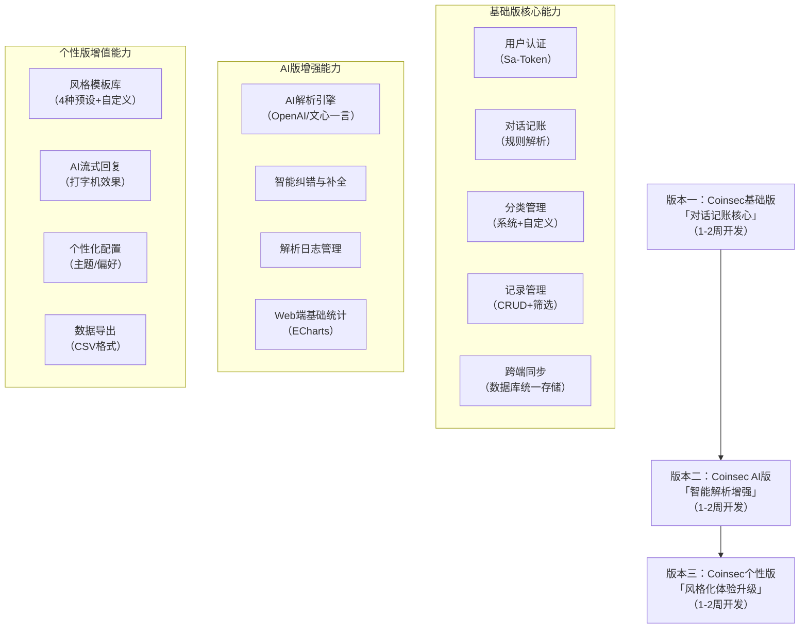

# Coinsec - 智能对话式个人记账系统需求文档

*建议 Logo 设计方向：融合 “硬币” 与 “对话气泡” 元素，主色调采用蓝色（信任）+ 绿色（理财）*

**文档版本**：V3.1

**编写日期**：2025-09-11

**适用阶段**：版本一（基础对话记账）→ 版本三（AI 风格化回复）

**品牌 Slogan**：「用对话记录收支，让记账更简单」

**核心定位**：轻量化、智能化、趣味化的个人记账工具

## 一、项目概述

### 1.1 项目名称

Coinsec - 智能对话式个人记账系统

*名称释义：Coin（货币）+ Sec（Security/Record，安全 / 记录），寓意 “安全记录每一笔收支”*

### 1.2 项目定位

Coinsec 打破传统记账软件的表单填写模式，以**自然语言对话**为核心交互入口，结合**AI 智能解析**与**多风格反馈**，为用户提供 “输入即记账” 的轻量化体验。同时支持 Flutter 移动端与 Vue3 Web 端跨平台同步，满足用户在不同场景下的记账、查账、分析需求，帮助用户轻松管理个人财务。

### 1.3 核心价值

| 价值维度      | 具体说明                                             |
| --------- | ------------------------------------------------ |
| **低门槛交互** | 无需学习复杂操作，日常口语化表达（如 “今天买咖啡花了 35 元”）即可完成记账，降低使用成本。 |
| **智能高效**  | 从规则解析到 AI 深度理解，支持复杂场景识别，减少手动调整，提升记账效率。           |
| **趣味化体验** | 多风格 AI 回复（阴阳怪气、可爱萌系等）打破记账的枯燥感，增强用户粘性。            |
| **跨端协同**  | 移动端快速记录、Web 端深度分析，数据实时同步，覆盖全场景使用需求。              |
| **安全可靠**  | 采用加密存储、Token 认证等机制，保障用户财务数据的安全性与隐私性。             |

## 二、目标用户与使用场景

### 2.1 目标用户分层

| 用户层级     | 核心特征                                           | 需求痛点                                  |
| -------- | ---------------------------------------------- | ------------------------------------- |
| **核心用户** | 18-35 岁学生、职场新人，熟悉手机操作，追求效率与新鲜感，记账频率高（每日 / 每周）。 | 传统记账软件操作繁琐，没时间填写详细表单；容易忘记记账，需要快速记录工具。 |
| **扩展用户** | 25-40 岁家庭用户，夫妻共同管理财务，需要共享记账数据，关注收支结构分析。        | 多用户权限管理需求；需要清晰的分类统计，辅助家庭财务规划。         |
| **潜在用户** | 理财新手，缺乏记账习惯，希望通过简单工具培养理财意识，关注基础收支平衡。           | 不知道如何分类记账；需要直观的数据分析，了解自己的消费习惯。        |

### 2.2 典型使用场景（带 Coinsec 品牌植入）

1.  **通勤途中快速记账**

    用户在地铁上购买早餐后，打开 Coinsec 移动端，输入 “早餐 6 元”，系统 1 秒内解析为 “支出 - 6.00 元 - 餐饮 - 今日 08:30”，无需其他操作即可完成记录。

2.  **复杂场景 AI 解析**

    用户输入 “上周六和朋友聚餐 AA，我垫付了 300 元，4 人平摊”，Coinsec 通过 AI 解析为 “支出 - 300.00 元 - 餐饮 - 2025-09-06”，并自动添加备注 “AA 聚餐，4 人平摊”。

3.  **风格化反馈互动**

    用户选择 “古代下人” 风格后，记账成功收到回复：“回主子，今日餐饮支出 300 元已记下，明细备注‘AA 聚餐’，请放心～”，提升记账趣味性。

4.  **周末 Web 端财务复盘**

    用户通过 Coinsec Web 端查看月度报表，系统生成 “餐饮支出占比 32%、交通支出占比 18%” 的环形图，帮助用户发现 “外卖支出过高” 的问题。

5.  **夫妻共同记账**

    妻子在移动端记录 “超市采购 200 元”，丈夫打开 Web 端时自动同步该记录，支持共同编辑分类与备注，实现家庭财务协同。

## 三、总体功能架构

Coinsec 采用 “迭代式开发” 策略，分三版逐步实现核心功能与增值体验，确保每个版本均具备独立使用价值：

## 四、详细功能需求

### 4.1 版本一：Coinsec 基础版（核心功能）

#### 4.1.1 用户认证模块（保障安全访问）

| 功能点  | 需求描述                                               | 优先级 | 验收标准                                                      |
| ---- | -------------------------------------------------- | --- | --------------------------------------------------------- |
| 账号注册 | 支持用户名（4-20 位字母 / 数字组合）+ 密码（≥8 位，含数字 + 字母）注册，用户名唯一。 | 高   | 1. 用户名重复时提示 “该用户名已被占用”；2. 密码不符合规则时提示 “密码需包含数字和字母，长度≥8 位”。 |
| 账号登录 | 用户名 + 密码登录，生成 Sa-Token（有效期 7 天），支持 “记住密码” 自动登录。    | 高   | 1. 登录成功后跳转至记账首页；2. 记住密码状态下，重启 App 无需重新登录。                 |
| 密码重置 | 本地模拟 “忘记密码”：输入用户名→验证预设问题→重置密码。                     | 中   | 1. 用户名不存在时提示 “该用户未注册”；2. 问题答案错误时提示 “答案不正确”。               |
| 个人中心 | 显示用户名、注册时间，支持修改密码、退出登录。                            | 高   | 1. 修改密码后需重新登录；2. 退出登录后清除 Token，跳转至登录页。                    |

#### 4.1.2 对话记账模块（核心交互）

| 功能点    | 需求描述                                                                                                                    | 优先级 | 验收标准                                                                                           |
| ------ | ----------------------------------------------------------------------------------------------------------------------- | --- | ---------------------------------------------------------------------------------------------- |
| 对话输入框  | 多行文本输入（≤500 字），底部 “发送” 按钮，输入时提示 “请输入记账描述（如‘今天吃饭花了 50 元’）”。                                                              | 高   | 1. 输入超过 500 字时提示 “输入内容过长，请精简”；2. 为空时点击发送提示 “请输入记账描述”。                                          |
| 规则解析引擎 | 基于关键词提取字段：・金额：匹配 “数字 + 元 / 块”（如 “35 元”→35.00）・类型：“花了 / 买”→支出，“收入 / 到账”→收入・时间：“今天 / 昨天”→对应日期，无时间默认当天・分类：关键词匹配（如 “吃饭”→餐饮） | 高   | 1. 输入 “今天吃饭花了 50 元”→解析为 “支出 50.00 元 - 餐饮 - 今日”；2. 输入 “昨天收入 300 元”→解析为 “收入 300.00 元 - 其他 - 昨天”。 |
| 解析结果预览 | 解析后显示卡片式预览：金额（红色 = 支出 / 绿色 = 收入）、类型、分类、时间，底部 “确认保存”“重新输入” 按钮。                                                           | 高   | 1. 预览信息与输入内容一致；2. 点击 “确认保存” 后跳转至记录列表页。                                                         |
| 解析失败处理 | 失败时提示具体原因：・无金额：“请包含具体金额（如‘35 元’）”・无类型：“请说明收入 / 支出（如‘收入 300 元’）”・其他：“描述不够清晰，请重新输入”                                       | 高   | 1. 输入 “今天吃饭”→提示 “请包含具体金额”；2. 输入 “50 元”→提示 “请说明收入 / 支出”。                                        |

#### 4.1.3 分类管理模块（灵活适配需求）

| 功能点    | 需求描述                                                       | 优先级 | 验收标准                                                  |
| ------ | ---------------------------------------------------------- | --- | ----------------------------------------------------- |
| 系统默认分类 | 初始化分类，支持 “支出 / 收入” 标签页切换：・支出：餐饮、交通、娱乐、购物、其他・收入：薪资、兼职、理财、其他 | 高   | 1. 标签页切换时分类列表同步更新；2. 新建记录时默认分类为 “其他”。                 |
| 自定义分类  | 支持新增（名称≤10 字，无特殊字符）、修改、删除（被引用时不可删除）。                       | 中   | 1. 新增 “宠物” 分类后，记录解析时匹配 “买猫粮”→“宠物”；2. 分类被引用时删除按钮置灰。    |
| 分类排序   | 长按拖动调整顺序，排序结果同步到所有端。                                       | 低   | 1. 拖动 “餐饮” 至首位后，分类列表中 “餐饮” 显示在第一行；2. Web 端同步显示调整后的顺序。 |

#### 4.1.4 记录管理模块（便捷查询维护）

| 功能点       | 需求描述                                          | 优先级 | 验收标准                                                  |
| --------- | --------------------------------------------- | --- | ----------------------------------------------------- |
| 记录列表      | 按时间倒序排列，每条记录显示：金额、分类标签、时间、原始文本预览，支持下拉刷新、上拉加载。 | 高   | 1. 新增记录后列表实时更新；2. 下拉刷新显示最新记录；3. 上拉加载历史记录。             |
| 筛选功能      | 顶部筛选栏：・时间筛选：今日、本周、本月、自定义・分类筛选：按支出 / 收入分类筛选    | 高   | 1. 选择 “本月 + 餐饮”→显示本月所有餐饮支出记录；2. 自定义时间范围支持选择开始 / 结束日期。 |
| 记录详情      | 点击记录显示详情：原始文本、金额、类型、分类、时间、备注，底部 “修改”“删除” 按钮。  | 高   | 1. 详情信息与数据库存储一致；2. 点击 “修改” 跳转至编辑页，“删除” 弹出确认框。         |
| 记录修改 / 删除 | 编辑页支持修改所有字段；删除需二次确认，删除后不可恢复。                  | 高   | 1. 修改金额后数据库同步更新；2. 删除记录后列表中不再显示，且无法恢复。                |

#### 4.1.5 跨端同步模块（数据无缝流转）

| 功能点    | 需求描述                                                | 优先级 | 验收标准                                              |
| ------ | --------------------------------------------------- | --- | ------------------------------------------------- |
| 自动同步   | 同一账号在移动端 / Web 端操作后，数据实时同步（基于数据库统一存储）。              | 高   | 1. 移动端新增记录后，Web 端刷新列表显示该记录；2. Web 端修改分类后，移动端同步更新。 |
| 同步状态提示 | 同步成功：顶部短暂提示 “数据已同步”；网络异常：提示 “同步失败，请检查网络”，网络恢复后自动重试。 | 中   | 1. 网络正常时操作后 1 秒内提示 “数据已同步”；2. 断网操作后联网，自动同步未同步数据。  |

### 4.2 版本二：Coinsec AI 版（智能增强）

#### 4.2.1 AI 解析引擎模块（提升解析能力）

| 功能点     | 需求描述                                                                                                             | 优先级 | 验收标准                                                                                                    |
| ------- | ---------------------------------------------------------------------------------------------------------------- | --- | ------------------------------------------------------------------------------------------------------- |
| AI 接口对接 | 支持配置切换 OpenAI / 百度文心一言：・配置项：API 密钥、模型类型、超时时间（默认 30 秒）・开关：AI 解析 / 规则解析切换                                          | 高   | 1. 配置 OpenAI 密钥后，调用 gpt-3.5-turbo 模型；2. 切换至 “规则解析” 后不再调用 AI 接口。                                         |
| 高级解析能力  | 支持复杂场景：・金额：“两百元”→200.00、“35.5 元”→35.50、“1k”→1000.00・时间：“上周五”→对应日期、“3 天前”→计算日期・场景：“AA 聚餐付 200 元”→支出 200.00 元 - 餐饮 | 高   | 1. 输入 “上周五兼职赚了 1k 元”→解析为 “收入 1000.00 元 - 兼职 - 上周五”；2. 输入 “3 天前买奶茶 35.5 元”→解析为 “支出 35.50 元 - 餐饮 - 3 天前”。 |
| 解析日志管理  | 记录每次解析：用户 ID、原始文本、AI 提示词、响应结果、耗时、状态（成功 / 失败），支持按时间查询。                                                            | 中   | 1. 解析失败时日志记录错误原因；2. 可按 “近 7 天” 筛选日志，查看解析耗时分布。                                                           |

#### 4.2.2 智能纠错与补全模块（优化用户体验）

| 功能点    | 需求描述                                                                               | 优先级 | 验收标准                                                                            |
| ------ | ---------------------------------------------------------------------------------- | --- | ------------------------------------------------------------------------------- |
| 模糊解析补全 | 不完整文本自动补全并提示确认：・输入 “买奶茶 20”→补全 “20 元”，提示 “是否为‘买奶茶 20 元’？”・输入 “昨天收入 500”→补全 “500 元” | 高   | 1. 输入 “买奶茶 20”→弹出确认框，点击 “是” 后解析为 “支出 20.00 元 - 餐饮 - 今日”；2. 点击 “否” 返回重新输入。       |
| 歧义处理   | 歧义文本引导选择：・输入 “今天收到 500”→提示 “请选择：收入 / 支出”・输入 “打车 30 元”→提示 “请选择分类：交通 / 其他”           | 高   | 1. 选择 “收入” 后解析为 “收入 500.00 元 - 其他 - 今日”；2. 选择 “交通” 后解析为 “支出 30.00 元 - 交通 - 今日”。 |

#### 4.2.3 Web 端基础功能模块（扩展使用场景）

| 功能点     | 需求描述                                           | 优先级 | 验收标准                                      |
| ------- | ---------------------------------------------- | --- | ----------------------------------------- |
| Web 端登录 | 与移动端共用账号，支持记住登录状态（7 天），响应式布局适配电脑 / 平板。         | 高   | 1. 输入移动端账号密码可正常登录；2. 电脑端显示完整功能，平板端布局自适应。  |
| 记录列表与筛选 | 左侧筛选栏（时间 + 分类）、右侧记录列表，支持表格 / 卡片视图切换。           | 高   | 1. 筛选条件与移动端一致；2. 表格视图显示完整字段，卡片视图与移动端样式统一。 |
| 基础数据统计  | 显示 “本月总收入 / 总支出 / 结余”，分类占比环形图（ECharts），支持切换月份。 | 高   | 1. 数据与记录列表统计一致；2. 点击环形图某分类，               |

> （注：文档部分内容可能由 AI 生成）